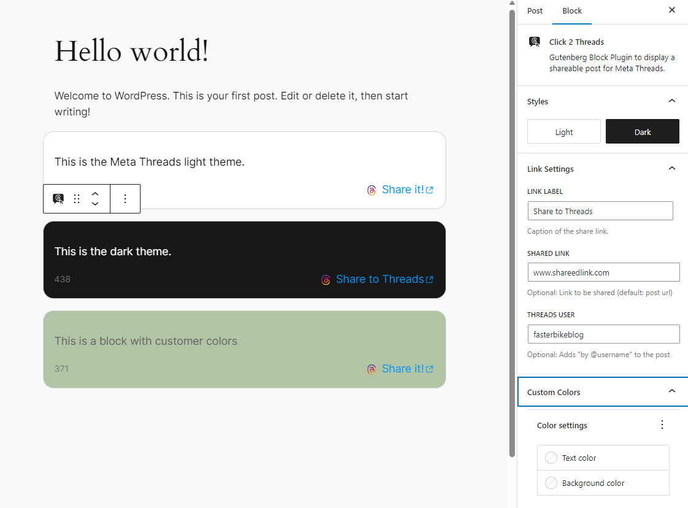

# Click 2 Share WordPress Block Plugin

The **Click 2 Share** plugin is a simple, one-click shareable block for the Gutenberg editor, making it effortless for blog visitors to share your content on social media platforms such as Meta Threads.

### Key Features

* **One-Click Share to Meta Threads**: Streamline the process of sharing blog posts, encouraging greater engagement and visibility on social media. Twitter / X to follow soon.
* **Gutenberg Block Integration**: Easily add the Click 2 Threads block to any post or page using the Gutenberg editor.
* **Customizable Settings**: Choose between dark and light base styles, set a username for attribution, and customize the default text for the share link. Further customization with CSS is possible.
* **Default Settings**: Set the default settings to be applied to every new block created.

## Development
 * This repo contains the plugin code, you can run `npm install` and `npm start` in you own Wordpress development environment. You can also try using [GitHub Wordpress Development](https://github.com/Eetezadi/Gitpod-Wordpress-Development).
 * Run `./build-plugin-zip.sh` to pack the plugin into a zipfile containing the PHP files (Wordpress Scripts don't do that)
 * Contributions and pull request are always welcome!
